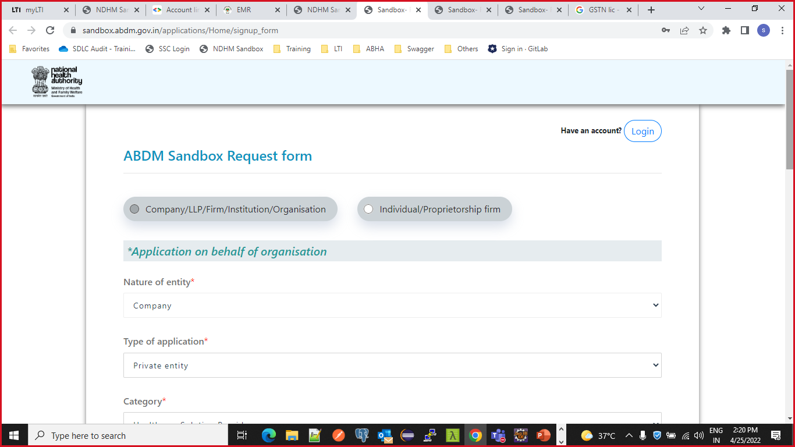

# User Manual for Sandbox Sign Up
**Step 1:**  
Start by registering yourself on ABDM Sandbox at the below URL  
https://sandbox.abdm.gov.in/applications/Home/signup_form  
**Step 2:**  
The application will be reviewed by the Sandbox Committee and after review, the Committee will give approval and rejection with remarks.  
_Note_: The committee meets once a week. Hence, please expect 7 days turnaround time.  
https://sandbox.ndhm.gov.in/applications/Home/admin

##### User Activity with new application:
**Step 1:** Signup using the below URL as _Company_ or _Individuals_ per requirement.
 https://sandbox.ndhm.gov.in/applications/Home/signup_form

  

Select appropriate _Entity_, _Type of Application_, _Category_ value.

**_Registere/License to operate in India:_** Select _Yes_ if a license is from India otherwise select _No_ then the committee will decide on a case-to-case basis.

Currently, try to select the appropriate _Intent For Request_ under which the user wants to register with. In case, an incorrect option is selected, _Don't worry_ the user can change it later.

**Step 2:** Click on Submit Button  

**URL:** https://sandbox.abdm.gov.in/applications/Home/signup_form  

