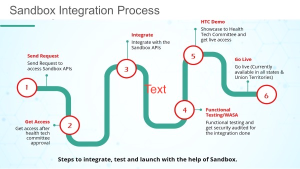

+++
title = "Sandbox Exit"
date = 2022-05-15T17:53:25+05:30
weight = 10
chapter = true
pre = "<b>10. </b>"
+++

## Sandbox Exit

**ABDM Sandbox Journey**

## Sandbox exit process

Post integrations, the following 4-step process will apply for any integrator to exit from the Sandbox. Kindly fill the form in your sandbox user account to initiate exit.

**Step 1:** Functional & non-functional Testing of the application by an internal NHA team Draft test cases for functional evaluation can be found in the below link 
- [Test cases for M1](../11-test-cases/milestone-1/)
- [Test cases for M2](../11-test-cases/milestone-2/)
- [Test cases for M3](../11-test-cases/milestone-3/)

*Note :* From 5th August 2022 onwards, the functional & non-functional testing of the application will be conducted by NHA empaneled agencies which are as below:

1. M/s FIME India Pvt. Ltd.

2. M/s Suma Soft Pvt. Ltd.

3. M/s Tata Communications

The interested integrators are requested to connect with any one of the above agencies for functional and non-functional testing/certification on chargeable basis. The integrators (new and the existing ones) who are not able to get themselves certified by the cut off date will be required to get the testing conducted by any of these agencies only. Please [click here](#agency-contact-details) for contact details of the above agencies.

**Step 2:** Security testing of the web/mobile application from any STQC or CERT-IN empaneled agency. Applicants are requested to engage with relevant agencies and submit the “Safe-to-Host” certificate to NHA
- Suggestive pointers on infrastructural requirements for security testing clearance can be found in [document {}](./NDHM_Secure_Application_Development-Reference_Document.pdf "download")
- To view List of CERT-IN empaneled agencies for Safe-to-Host certification please follow below steps
    1. Please go to the [link {}](https://www.cert-in.org.in/).
    2. Navigate to Cyber Security Assurance tab and select Empanelment by CERT-in from dropdown.

STQC may also reach out to perform validation testing on a few sample applications.

**Step 3:** A final round of approval for application go-live will be sought from the internal team at NHA. Applicants will be required to share the following before the committee:
- Functional testing report for integrations completed
- Safe-to-Host certificate for the application
- Summary details of the application duly filled in [excel {}](./Details_required_for_Production_Keys_template.xlsx "download")

**Step 4:** Once approved, access will be shared for integration in the production environment.

Kindly ensure the partnering HIP is registered on [Health Facility Registry {}](https://facility.ndhm.gov.in/) in order to interface with the ABDM infrastructure.

Detailed walkthrough on facility registration steps can be found in [video link {}](https://www.youtube.com/watch?v=lqe-dlQcLIo). Once registered, the HIP will be required to update production access bridge ID in their Health Facility Registry profile – please find all steps demonstrated in [document {}](./Steps_for_linkage_of_a_Verified_Health_Facility.pdf "download")

The application is now expected to be prepared for go-live in respective healthcare facilities.

Please ensure facility staff is well-versed with the new software and is briefed on ABDM building blocks well in advance to assist patients.

## Agency Contact Details

Sr.No|Agency Name|Email Address|Contact Number|Company URL- |
| -- | ---| ----- | ----- | ----- |
1|M/s FIME India Pvt. Ltd|salesindia@fime.com|080-43358036|[Click here](https://www.fime.com/shop/product/abdm-ayushman-bharat-digital-mission-certification-services-4263#standards)|
2|M/s Suma Soft Pvt. Ltd|abdm@sumasoft.com|8828222799|[Click here](https://www.sumasoft.com/)|
3|M/s Tata Communications|hesrc.helpdesk@tatacommunications.com|1800-419-5588|[Click here](https://www.tatacommunications-ts.com/)|

