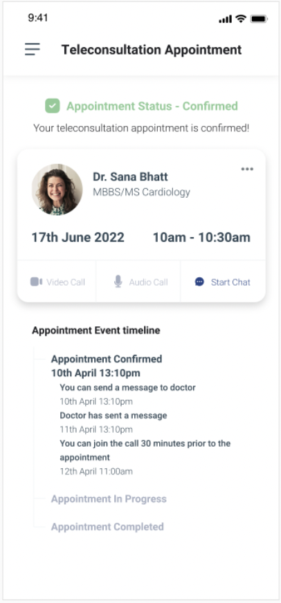

# Confirm Booking

- Upon successful collection of payment or acceptance of agreeing to pay as per the terms sent by the HSPA the EUA calls the /confirm API on the HSPA. 
- The HSPA responds with an on_confirm API to confirm the booking of the service and sends confirmation of the appointment with the doctor along with all the details of the appointment such as the doctor details, slot, payment, billing etc. 

## UI Reference


## API Sequence


## Example JSONs
The /init API is fired to the HSPA with the selected date and time as well as the customer and billing details. 

> URL: {to be added}
> Method: POST
> Headers: Authorisation 

```
{
   "context": {
       "domain": "uhi:consultation",
       "country": "IND",
       "city": "std:080",
       "action": "confirm",
       "core_version": "0.7.1",
       "bap_id": "exampleapp.io",
       "bap_uri": "https://api.exampleapp.io/uhi/v0/",
       "bpp_id": "examplehspa.io",
       "bpp_uri": "https://api.examplehspa.io/uhi/v0/",
       "message_id": "5ac3dd78-829e-4c7d-9139-a15adbb582cc",
       "transaction_id": "8fa243cd-9f26-4a43-a422-714ba8f41bf2",
       "timestamp": "2021-03-23T10:00:40.065Z"
   },
   "message": {
       "order":{
           "provider": {
               "id": "289edce4-d002-4962-b311-4c025e22b4f6",
               "descriptor": {
                   "name": "MAX Hospitals"
               }
           },  
           "item": {
               "id": "1",
               "descriptor": {
                   "name": "Consultation"
               },
               "fulfillment_id": "1",
               "price": {
                   "currency": "INR",
                   "value": "1000"
               },
               "quantity": {
                   "available": "1"
               }
           },
           "fulfillment": {
               "id": "1",
               "type": "DIGITAL-CONSULT",
               "agent": {
                   "id": "uhi://hpr?id=6486",
                   "name": "Dr. Sana Bhatt",
                   "gender": "Female",
                   "image": "https://image/of/person.png"
               },
               "start": {
                   "time": {
                       "timestamp": "2022-04-20T12:00:00Z+5:30"
                   }
               },
               "end": {
                   "time": {
                       "timestamp": "2022-04-20T12:30:00Z+5:30"
                   }
               },
               "customer" : {
                   "id" : "john.doe@abdm",
                   "person" : {
                       "name" : "john Doe",
                       "gender" : "male"
                   },
                   "contact" : {
                       "phone" : "+919764718472",
                       "email": "customer@example.com"
                   }
               }
           },
           "billing": {
               "name": "John Doe",
               "address": {
                   "door": "21A",
                   "name": "ABC Apartments",
                   "locality": "Dwarka",
                   "city": "New Delhi",
                   "state": "New Delhi",
                   "country": "India",
                   "area_code": "110011"
               },
               "email": "user@example.com",
               "phone": "+919876543210"
           },
           "quote":{
               "price":{
                    "currency": "INR",
                    "value": "1500"
                    },
               "breakup":[
                   {
                       "title": "Consultation",
                       "price": {
                           "value": "1000",
                           "currency": "INR"
                       }
                   },
                   {
                       "title": "CGST @ 5%",
                       "price": {
                           "value": "50",
                           "currency": "INR"
                       }
                   },
                   {
                       "title": "SGST @ 5%",
                       "price": {
                           "value": "50",
                           "currency": "INR"
                       }
                   },  
                   {
                       "title": "Registration",
                       "price": {
                           "value": "400",
                           "currency": "INR"
                       }
                   }
               ]
           },
           "payment": {
               "uri": "https://api.bpp.com/pay?amt=1500&txn_id=ksh87yriuro34iyr3p4&mode=upi&vpa=sana.bhatt@upi",
               "tl_method": "http/get",
               "params": {
                   "transaction_id": "abc128-riocn83920",
                   "amount": "1500",
                   "mode": "upi",
                   "vpa": "sana.bhatt@upi"
               },
               "type": "ON-ORDER",
               "status": "PAID"
           }
       }
   }
}
```
> **Response to /init call**\
> **Status Code: {to be added} (ACK)**\
> **Postman Collection: {to be added}**

### A sample response via /on_confirm  from the HSPA is as follows:

```
{
   "context": {
       "domain": "uhi:consultation",
       "country": "IND",
       "city": "std:080",
       "action": "on_confirm",
       "core_version": "0.7.1",
       "bap_id": "exampleapp.io",
       "bap_uri": "https://api.exampleapp.io/uhi/v0/",
       "bpp_id": "examplehspa.io",
       "bpp_uri": "https://api.examplehspa.io/uhi/v0/",
       "message_id": "5ac3dd78-829e-4c7d-9139-a15adbb582cc",
       "transaction_id": "8fa243cd-9f26-4a43-a422-714ba8f41bf2",
       "timestamp": "2021-03-23T10:00:40.065Z"
   },
   "message": {
       "order":{
           "id":"18393748",
           "state":"CONFIRMED",
           "provider": {
               "id": "289edce4-d002-4962-b311-4c025e22b4f6",
               "descriptor": {
                   "name": "MAX Hospitals"
               }
           }, 
           "item": {
               "id": "1",
               "descriptor": {
                   "name": "Consultation"
               },
               "fulfillment_id": "1",
               "price": {
                   "currency": "INR",
                   "value": "1000"
               },
               "quantity": {
                   "available": "1"
               }
           },
           "fulfillment": {
               "id": "1",
               "type": "DIGITAL-CONSULT",
               "agent": {
                   "id": "uhi://hpr?id=6486",
                   "name": "Dr. Sana Bhatt",
                   "gender": "Female",
                   "image": "https://image/of/person.png"
               },
               "start": {
                   "time": {
                       "timestamp": "2022-04-20T12:00:00Z+5:30"
                   }
               },
               "end": {
                   "time": {
                       "timestamp": "2022-04-20T12:30:00Z+5:30"
                   }
               },
               "customer" : {
                   "id" : "john.doe@abdm",
                   "person" : {
                       "name" : "john Doe",
                       "gender" : "male"
                   },
                   "contact" : {
                       "phone" : "+919764718472",
                       "email": "customer@example.com"
                   }
               }
           },
           "billing": {
               "name": "John Doe",
               "address": {
                   "door": "21A",
                   "name": "ABC Apartments",
                   "locality": "Dwarka",
                   "city": "New Delhi",
                   "state": "New Delhi",
                   "country": "India",
                   "area_code": "110011"
               },
               "email": "user@example.com",
               "phone": "+919876543210"
           },
           "quote":{
               "price":{
                    "currency": "INR",
                    "value": "1500"
                    },
               "breakup":[
                   {
                       "title": "Consultation",
                       "price": {
                           "value": "1000",
                           "currency": "INR"
                       }
                   },
                   {
                       "title": "CGST @ 5%",
                       "price": {
                           "value": "50",
                           "currency": "INR"
                       }
                   },
                   {
                       "title": "SGST @ 5%",
                       "price": {
                           "value": "50",
                           "currency": "INR"
                       }
                   }, 
                   {
                       "title": "Registration",
                       "price": {
                           "value": "400",
                           "currency": "INR"
                       }
                   }
               ]
           },
           "payment": {
               "uri": "https://api.bpp.com/pay?amt=1500&txn_id=ksh87yriuro34iyr3p4&mode=upi&vpa=sana.bhatt@upi",
               "tl_method": "http/get",
               "params": {
                   "transaction_id": "abc128-riocn83920",
                   "amount": "1500",
                   "mode": "upi",
                   "vpa": "sana.bhatt@upi"
               },
               "type": "ON-ORDER",
               "status": "PAID"
           }
       }
   }
}
```


