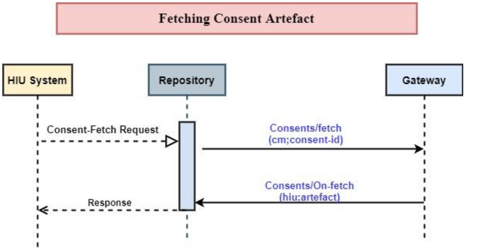

### Fetching the Consent artefact

### Overview of the functionality

 - Once the patient grants consent to the HIU, the CM notifies the HIU system of the consent grant via the gateway.
 - If the patient grants for multiple HIPs, then multiple consent artefacts are generated - one for each HIP.
 - The HIU now first fetches all the consent-artefacts that were generated for its request.

### API Sequence

The following diagram explains the Fetching of Consent artefact




### API Information Request Response


### 1. Generate the Gateway session

Bearer token is received as part of respose and should be passed a Authorization token for subsequent API calls.

**URL:** https://dev.ndhm.gov.in/gateway/v0.5/sessions

**Request:** POST  

**Body:**

```json
{
    "clientId": "your-clientID",
    "clientSecret": "your-clientSecret",
    "grantType": "client_credentials"
}
```

**Response:** 

200   OK

```json
{
    "accessToken": "eyJhbGciOiJSUzI1NiIsInR5cCIgOiAiSldUIiwia2lkIiA6ICJBbFJiNVdDbThUbTlFSl9JZk85ejA2ajlvQ3Y1MXBLS0ZrbkdiX1RCdkswIn0.eyJleHAiOjE2NTMzNjkyNTYsImlhdCI6MTY1MzM2ODY1NnR",
    "expiresIn": 600,
    "refreshExpiresIn": 1800,
    "refreshToken": "eyJhbGciOiJIUzI1NiIsInR5cCIgOiAiSldUIiwia2lkIiA6ICIyMWU5NzA4OS00ZTcxLTQyNGEtOTAzYS1jOTAyMWM1NmFlNWYifQ.eyJleHAiOjE2NTMzNzA0NTYsImlhdCI6MTY1MzM2ODY1NiwianRpIjoi",
    "tokenType": "bearer"
}
```


### Postman + Curl Collection 

**Download the Postman Collection** [here](/abdm-docs/Postman/)

**Download the Curls** [here](/abdm-docs/Curls/)
