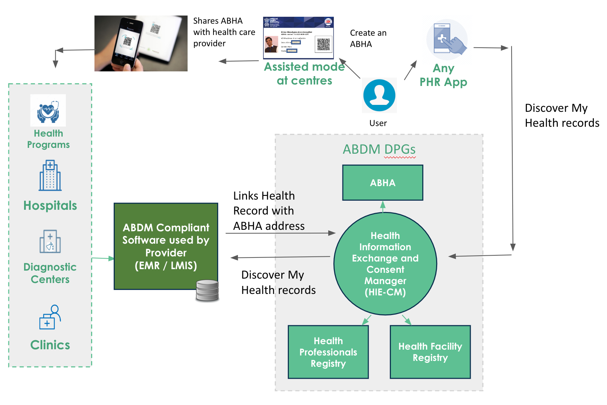

+++
title = "Milestone 2"
date = 2023-04-03T04:10:00+05:30
weight = 3
chapter = true
pre = "<b>3. </b>"
+++

**Functionalities to be supported as part of Milestone 2:** 

- Link health records with ABHA address
- Allow users to discover their health records 
 

- Save user consents 
- Share health records after verifying consent
 

## M2 Test Cases mapping by Role

|      Applicable To                         |   HMIS / LMIS (PVT)  |   Govt. Health App  |   
|-------------------------------|----------------------|--------------------|                 
|   **Health Record Formats**                      |   Mandatory          |   Mandatory        |  
|   **Understand Care Context**                     |   Mandatory           |   Mandatory        |  
|  **Link Care Context**                    |        |           |  
|   HIP Initiated Linking             |   Mandatory           |   Mandatory | 
|   Notification to Mobile             |   Mandatory           |   Mandatory | 
|   Discovery & Linking            |   Mandatory           |   Mandatory | 
|   **Understanding Consents**             |   Mandatory           |   Mandatory | 
|  **Store Consent Artefacts**  |  Mandatory                    |  Mandatory                 |                
|   **Request Health Records**     |   Mandatory          |   Mandatory        |  
|   **Packaging Health Data**         |   Mandatory          |   Mandatory        |  
|   **Encryption & Decryption**             |   Mandatory          |   Mandatory        |  
|   **Transferring Health Data**  |   Mandatory          |   Mandatory        |   

## This section covers:
{}
1. Health Record formats
2. Understanding care context
3. Linking care context
	- HIP initiated linking 
	- Notification to mobile
	- Discovery & Link
4. Understanding Consents
5. Storing consent notifications
6. Request for Health Records  
7. Packaging Health Data
8. Transferring Health Data
{}
