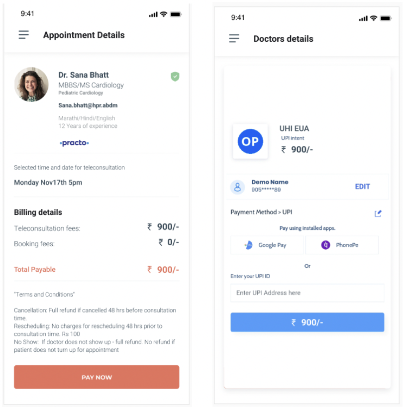

# Collect Payment if Required

- The HSPA responds to the request by the EUA through on_init API.
- The HSPA sends the revised quote for the service booking and additionally sends terms of payment for the service.
- Depending on the payment terms the next step could lead to the EUA redirecting the user towards a payment gateway.

## UI Reference

