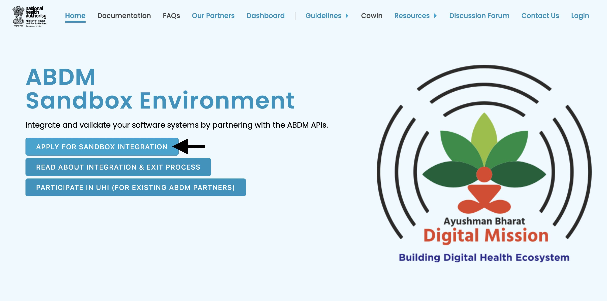

### The UHI Registry 

Before your EUA or HSPA app can talk to other UHI apps, you must first add it into the UHI registry. 

Go to the Sandbox webpage at [https://sandbox.abdm.gov.in/](https://sandbox.abdm.gov.in/)

If you have already signed up for the Sandbox use the link for existing ABDM partners [https://sandbox.abdm.gov.in/applications/Home/signup_form_UHI](https://sandbox.abdm.gov.in/applications/Home/signup_form_UHI)

If you are new to the ABDM sandbox, ensure you select if you want to build an UHI EUA or UHI HSPA or both. 

Please note that the architecture requires your EUA / HSPA app to have a end point URL that can be reached on the internet.

Once you finish signing up, the ABDM team will contact you to share information on your end point URL  